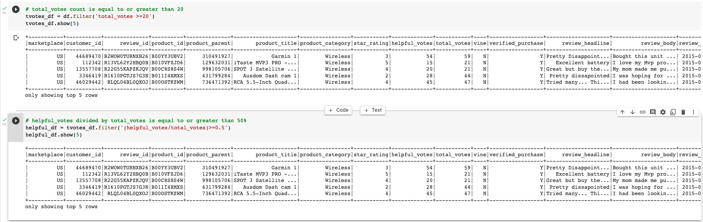
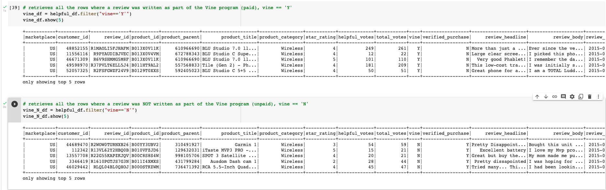
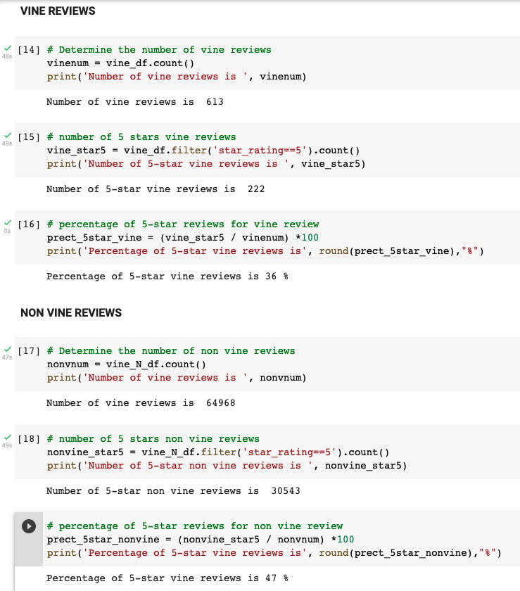
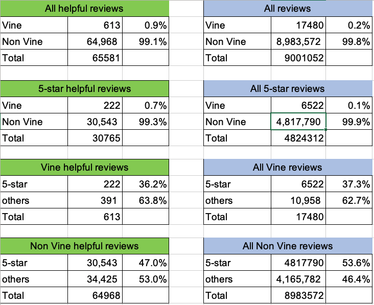

# Amazon_Vine_Analysis

## Overview
The purpose of this analysis is to analyze Amazon reviews written by members of the paid Amazon Vine program, to determine if there is any bias toward favorable reviews from Vine members in our dataset. The Amazon Vine program is a service that allows manufacturers and publishers to receive reviews for their products. Companies like SellBy pay a small fee to Amazon and provide products to Amazon Vine members, who are then required to publish a review.

First, we pick one of Amazon review datasets and use PySpark to perform the ETL process to extract the dataset, transform the data, connect to an AWS RDS instance, and load the transformed data into pgAdmin. Then, we use PySpark, Pandas, or SQL to determine if there is any bias toward favorable reviews from Vine members in our dataset. Finally, a written summary of the analysis is prepared for submission to the SellBy stakeholders.

# Results

We filtered the data to retrieve all the rows where the total_votes count is equal to or greater than 20 to pick reviews that are more likely to be helpful and to avoid having division by zero errors later on. In addtion, we select those rows where the  number of helpful_votes divided by total_votes is equal to or greater than 50%, to analyze them in a "helpful review catergory".

 

Then we would like to see how many vine and non vine reviews are there. So we create tables on "vine=Y" and "vine=N" respectively.
 

In addition, we investigated how many reviews are 5-star in vine and non vine catergory respectively.
 

The result shows that there is only 1% of reviews are paid reviews. There are 613 vine reviews and 36.2% of them are 5-star. For non-vine reviews, there are 64,968 reviews and 47% are 5-star. It indicates that non vine reviewers are more likely to give 5-star rating than vine's. This matches with the results in all reviews without narrowing to helpful reviews. In the whole data set, we can see more than half of the reviews are 5-star in non vine catergory, while there's only 37.3% 5-star rating in vine catergory.

 

 # Summary

 The major of reviews on Amazon wireless products come from non vine participants (99.1%) while vine participants' contribution is less than 1%. Among all these reviews, 5-star rating is low, less than 1% of reviews are rated 5-star. In addition, non vine participants have higher 5-star rating rate. Findings in helpful reviews dataset conforms with the whole data set with all the reviews. Thus we can induce that there is not bias on paid reviews, however, non paid reviews have higher 5-star rating rate. 

